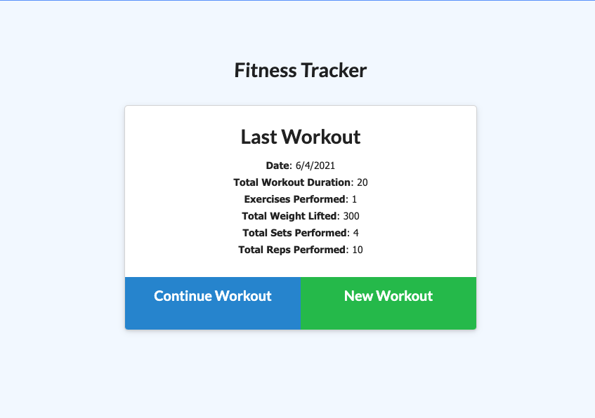
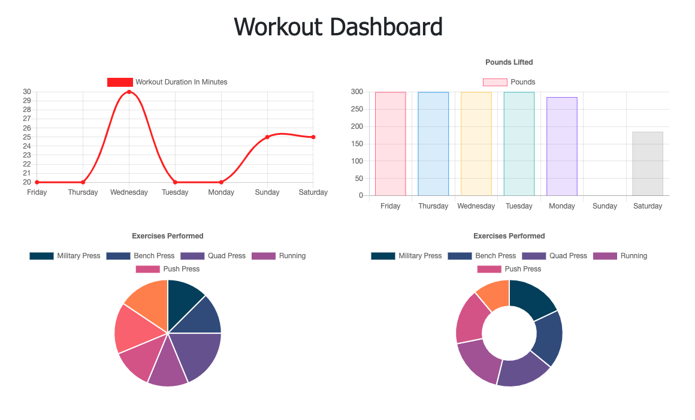

# Workout Tracker

## Description

The purpose of this application is to create a workout tracker where you can log your workouts and view a dashboards with summary charts.

## Functionality

* User visits home page where their last workout is displayed
* User can edit this workout or create a new one
* User can visit the Dashboard which provides a detail view of the workouts over the past 7 days.

## NPM Packages
I used the following npm packages to build this application:
* express
* mongo
* morgan

## Live App

This app is deployed through Heroku [here](https://immense-hollows-33155.herokuapp.com/).

